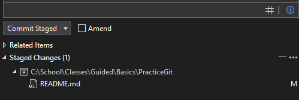

# PracticeGit

## Prepwork Space

* Open Readme.md : Including in project, look in Solution Explorer
* Terminal : View -> Terminal
	* Appears Below
* GitHub Changes : View -> Github Changes
	* Appears to the Right

	

## In the end
You will know how to use git to  
* Commit and Push Changes online
* Create Branches
* Switch Between Branches
* Merge Branches

using command line.

## Step by Step

1. ***git status***  
Git tracks changes to your project as you save.  

---
Type your name below   

> What's your name? :  Replace this text with your name

And save the file ( ctrl + s )

--- 
In the terminal type 

`git status`

Example : `C:\MySchoolProjects\Git_Project\git status`

***Result***

Git status shows us files that have been changed / saved since the last commit.

### What Visual Studio Sees

Look at your Git Changes window we opened earlier. You can see the same information as git status. Our README.md is located under `changes`.

Keep an eye on your Git Changes window to see whats happening as we work.

Lets stage our files to get ready to commit.

---
2. ***git add \****

After you've made changes to your project, you need to tell git what changes you want to commit. This is called ***Staging***.

Notice with our `git status`, README.md is in red, that means it is not staged. To stage it, in terminal type

`git add *`

> We use the git keyword, followed by the command add, then a astrix *. The astrix is a symbol commonly used to indicate ALL. So git add * means add all files.

Then type `git status` again

***Result***

You should now see our README.md in green. This means it is ***Staged***. Git knows that we want to commit this file.

You can also do individual files, or folders. But I use `git add *` most of the time.

### What Visual Studio Sees

Our Git Changes has now moved our README.md under `staged changes`.

Lets commit our changes with a message.

---
3. ***git commit -m "Message"***

Now that we have changes staged we can "commit" them.

> ***What IS commit:***  
Commit saves your current project changes to git. You can see a list of all your commits by opening View -> Git Repository.
>
>  
> Each commit is a version of my project I could revert to if something broke.

Now with our README.md staged, lets commit our change.

In terminal type

`git commit -m "Update README.md"`

> We have our git keyword, followed by the command "commit". Next we have -m. This is a paremeter which says we want to include a message. Followed by double quotes and our message "Update README.md".  
>
> You can do git commit without -m, but then it will just ask you for a message aftwards, so this is quicker.

Now run `git status`.

***Result***

 
After we **commit** our **staged change** there should be no files in our `git status`. That means git and our project now have the same changes.

### What Visual Studio Sees

"There are no unstanged changes..."

***Imporant*** This is all Local. This means your tracking everything on your current computer, but if something happens to your computer, you will still lose data. Lets `push` our repository online to save our on `GitHub`.

---

4. ***git push***  

`pushing` your repository uploads all your commits to GitHub. This saves them in the cloud. You can can then view your repository in your GitHub account.

In terminal type

`git push`

---
## Keywords
* `git` - Used to access git commands
	* `git <command> <paremeter>`

### Commands

Git status
* `status` - view which files have changed
	* `git status`
Commiting and Pushing your changes
* `add *` - Stage your current changes
	* `git add *`  
* `commit -m "Message"` - Commit your current changes with your "Message"
	* `git commit -m "Your Message"`
* `push` - Push your local commits to Github
	* `git push`

---
Working with Branches
* `branch` - Displays all branches ( current branch in green )
	* `git branch`
* `checkout -b BranchName` - Creates a new branch and switches to it
	* `git checkout -b MyNewBranch`
* `checkout branchName` - Switch between branches
	* `git checkout main` - switch to main branch
* `merge branchToMerge` - Merge a different branch into current branch
	* `git merge branchToMerge` 
